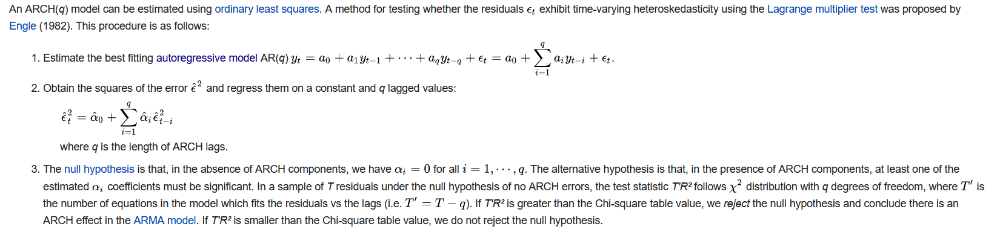

```{r setup, include=FALSE}
knitr::opts_chunk$set(echo = TRUE)
Sys.setenv(language = "en")
library(magrittr)
library(data.table)
library(aTSA)
library(forecast)
library(e1071)
library(ggplot2)
library(rugarch)
library(aTSA)


```


# 1. kointegration og fejlkorrektion

```{r}

data <- rio::import("week10-selfstudy/renter.csv", setclass = "data.table")

y <- data$y
z <- data$z


plot(diff(y))
plot(z)

acf(y,lag.max = 150)
adf_y <- adf.test(y)
adf_z <- adf.test(z)
adf_y_diff <- adf.test(diff(y))

auto.arima(y)
```

# 2. Volatilitet


## 2.1 

Modsat en AR model så modellere man sin noise process i en GARCH model, hvilket giver mulighed for at fange
volatility clusters osv.

## 2.2

```{r}

volatilitet <- rio::import("week10-selfstudy/volatilitet.csv", setclass = "data.table")

return <- volatilitet$aktiekurs %>% log() %>% diff()
plot(return)
acf(return)
acf(abs(return))

qqnorm(return)
qqline(return)

kurtosis(return)
kurtosis(rnorm(n = 2010,mean(return),sd(return)))

ggplot(data.frame(return = return, normal = rnorm(n = 2010,mean(return),sd(return)))) +
  geom_density(aes(x = return), color = "blue") +
  geom_density(aes(x = normal), color = "red")

```


## 2.3




## 2.4

```{r}
volatilitet <- rio::import("week10-selfstudy/volatilitet.csv", setclass = "data.table")
return <- volatilitet$aktiekurs %>% log() %>% diff()

result_object <- ugarchspec(variance.model = list(model = "sGARCH",
                                                  garchOrder = c(1,1)),
                            mean.model = list(armaOrder = c(5,0)),
                            distribution.model = "norm")
garch_est_return <- ugarchfit(spec = result_object, data = return)
garch_est_price <- ugarchfit(spec = result_object, data = volatilitet$aktiekurs)
```

## 2.5

```{r}
garch_est_return
garch_est_price
```

## 2.6

```{r}

# kig på plot og ACF

#engle test for ARCH
auto.arima(y = volatilitet$aktiekurs,d = 0,max.q = 0)
arima_price <- arima(x = volatilitet$aktiekurs,order = c(1,0,0))
arch.test(arima_price)

auto.arima(y = return,d = 0,max.q = 0)
arima_return <- arima(x = return,order = c(4,0,0))
arch.test(arima_return)

```

skip 2.7, 2.8, 2.9

## 2.10


```{r}


```

